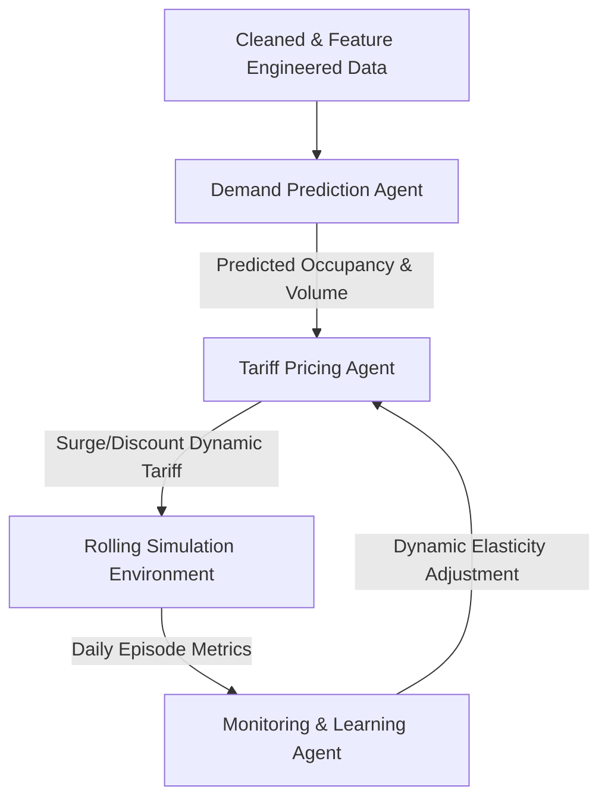

# Agentic AI-Based Dynamic Tariff Optimization for EV Charging Networks

This project implements a self-improving, multi-agent AI system designed to optimize electric vehicle (EV) charging tariffs dynamically. By leveraging large-scale historical charging session data, the system predicts station utilization and congestion, computes optimal real-time pricing, and continuously refines its demand elasticity parameters via a closed-loop feedback mechanism. 

The primary objectives are to mitigate grid/station congestion during peak hours (peak shaving), stimulate charger utilization during off-peak windows (valley filling), stabilize the grid, and ensure cost-transparent charging for users.

---

## 🚀 Key Features & Project Highlights

* **Multi-Agent Framework**: Three specialized agents working in tandem—**Demand Prediction**, **Tariff Pricing**, and **Monitoring & Learning**.
* **High-Performance Models**: LightGBM regression models with exceptional forecasting accuracy (Occupancy $R^2 \ge 95\%$; Charging Volume $R^2 \ge 80\%$).
* **Closed-Loop Feedback**: A self-tuning system that adjusts user elasticity estimates dynamically based on simulated daily outcomes.
* **Widescreen Interactive Deliverables**: Fully styled, interactive web presentation slides, and an interactive **Simulation Console** featuring custom charts, parameter sliders, and real-time visualization.
* **Enterprise Presentation**: Automated generation of widescreen PPTX presentations aligning with professional consulting design guidelines.

---

## 📂 Project Architecture & Directory Structure

```directory
SB_Analytics/
├── app/                              # Simulation Console and Interactive Presentation
│   ├── data/
│   │   └── simulation_results.json   # Output JSON processed from CSVs for the dashboard
│   ├── index.html                    # Frontend interface (Slide Deck & Simulation Console)
│   ├── main.js                       # Charting and interactive simulation dashboard logic
│   ├── style.css                     # Premium dark glassmorphism styling
│   └── server.py                     # Light http.server for local deployment
├── Datasets OP_26 Analytics/         # Raw project datasets (ACN and UrbanEV Shenzhen)
├── deck/                             # Generated PPTX slides output directory
├── notebooks/                        # Jupyter notebook workspace
│   └── agentic_ev_tariff_optimization.ipynb  # End-to-end model training & analysis pipeline
├── outputs/                          # Generated datasets, metrics, and visualization plots
│   ├── acn_cleaned_sessions.csv
│   ├── acn_metrics.csv
│   ├── acn_simulation_results.csv
│   ├── eda_profile.png               # EDA visual profiles
│   ├── simulation_results.png        # Elasticity simulation comparison charts
│   ├── urbanev_metrics.csv
│   └── urbanev_simulation_results.csv
├── src/                              # Core pipeline scripts
│   ├── generate_deck.py              # Automated PPTX slide generator
│   └── generate_simulation_json.py   # Processes simulation CSVs into frontend JSON
├── OP'26 Analytics.pdf               # Project background description document
├── README.md                         # Project documentation (This file)
└── .gitignore                        # Git ignore configuration
```

---

## 📊 Datasets & Feature Engineering

The system aligns and trains on two distinct EV charging profiles:
1. **Caltech ACN-Data**: High-resolution workplace charging session data (over 30,000 sessions) mapping transaction durations, energy delivered, and user inputs.
2. **Shenzhen UrbanEV Dataset**: Large-scale public grid matrix representing spatial-temporal charging behavior across 24,798 charging piles.

### Preprocessing & Scaling
* **INR Currency Alignment**: Default currency metrics are multiplied by a scaling factor of **15.0** to match Indian Rupee baseline metrics (averaging ₹14.38/kWh).
* **Workplace Sessions Cleaned**: Session-level charging profiles forward-fill nested user inputs, parse precise timestamps, and aggregate durations into hourly intervals.
* **Spatial Reshaping**: UrbanEV matrix representations (2.13 million records) are reshaped into long form, tracking spatial occupancies and utilization rates.

### Feature Engineering
* **Charger Utilization Rate**: Calculated as $\text{Active Charging Time} \mathbin{/} \text{Total Charger Capacity}$.
* **Queue Length Proxy**: Computed as $\max(0, \text{Occupancy} - \text{Capacity})$ to model structural backlog and wait times.
* **Temporal Lags & Rolling Statistics**: Includes 1-hour, 2-hour, and 24-hour lags, alongside 3-hour rolling averages, capturing auto-regressive demand patterns.

---

## 🤖 Agentic AI Modules



### 1. Demand Prediction Agent
Trained using LightGBM Regressors to forecast future charging occupancy and volume (kW charging load) concurrently.
* **Congestion Probability**: Centered on an 80% utilization rate, translated through a sigmoid activation function to output high-congestion risks.
* **High Predictive Performance**:
  * **UrbanEV**: Occupancy $R^2 = 98.68\%$; Charging Volume $R^2 = 91.07\%$
  * **ACN**: Occupancy $R^2 = 95.24\%$; Charging Volume $R^2 = 80.57\%$

### 2. Tariff Pricing Agent
Computes real-time dynamic pricing using predicted station occupancy:
* **Surge Pricing**: If predicted utilization is $> 80\%$, the price scales linearly from a baseline of ₹15.00/kWh up to a cap of ₹25.00/kWh.
* **Discount Pricing**: If predicted utilization is $< 30\%$, the price decreases linearly from the baseline down to a floor of ₹10.00/kWh.
* **Demand Elasticity Response**: Simulates user responses to price variations:
  $$D_{\text{elastic}} = D_{\text{predicted}} \times \left(1 - \epsilon \times \frac{P_{\text{dynamic}} - P_{\text{baseline}}}{P_{\text{baseline}}}\right)$$

### 3. Monitoring & Learning Agent
Acts as a closed-loop supervisor evaluating performance (Revenue Gain %, Queue Reduction %, and Off-Peak Uplift) at the end of each daily simulation episode. It adjusts the elasticity parameter $\epsilon$ (bounded between $0.05$ and $0.60$) to prevent grid over-correction:
* Increases $\epsilon$ when off-peak uplift is sluggish or severe congestion persists.
* Decreases $\epsilon$ (by up to $0.10$) if a sharp revenue drop ($> 10\%$ vs. baseline) is registered, protecting network revenue.

---

## 🛠️ Installation & Setup

Ensure you have a Python environment setup (Python 3.8+ recommended).

### 1. Install Dependencies
Install the required machine learning, visualization, and presentation generation libraries:
```bash
pip install pandas numpy lightgbm scikit-learn matplotlib python-pptx
```

### 2. Run the Notebook Pipeline
Open the Jupyter notebook located at `notebooks/agentic_ev_tariff_optimization.ipynb` and execute the cells. This trains the LightGBM models, runs the rolling dynamic simulation, and exports the resulting CSV datasets and figures to the `outputs/` folder.

### 3. Export Presentation & Process Dashboard JSON
Run the helper scripts in `src/` to update deliverables and bundle data for the web console:
```bash
# Generate PPTX slide presentations
python src/generate_deck.py

# Convert simulation outputs into JSON for the web console
python src/generate_simulation_json.py
```

---

## 🌐 Launching the Simulation Console & Slide Deck

A premium, interactive web interface is provided in the `app/` folder. It functions as both an interactive slide presentation and a live simulation dashboard.

1. **Start the Web Server**:
   ```bash
   python app/server.py
   ```
2. **Access the Interface**:
   Open your browser and navigate to **[http://localhost:8000](http://localhost:8000)**.

### Features of the Web Dashboard
* **Dynamic Slides 1–8**: Fully coded HTML representation of the project pitch deck using dark mode glassmorphism.
* **Interactive Console**: Allows users to interactively modify baseline prices, surge caps, discount floors, and elasticity parameters.
* **Real-time Charts**: Visualizes hourly profiles of baseline occupancy vs. dynamic occupancy, baseline volume vs. dynamic volume, and the calculated dynamic tariff curve.
* **Interactive Feedback Loop**: Displays a mock closed-loop training graph plotting the adjustment of the elasticity coefficient over simulation epochs.
